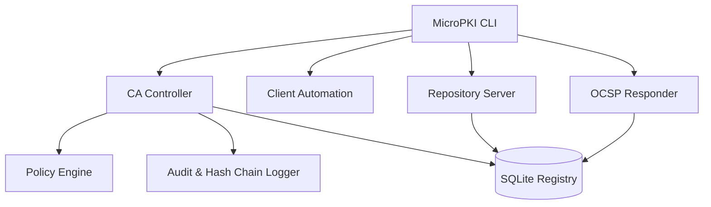

# MicroPKI - A Minimal Public Key Infrastructure

MicroPKI is a Go-based PKI suite demonstrating core functionalities like Root CA generation, intermediate CAs, end-entity certificate issuance, revocation (CRL), real-time status tracking (OCSP) and custom path-validation Client workflows! It integrates with a backend SQLite registry for deterministic ledger keeping and implements robust cryptographic audit tracking.

## Architecture & Security Enforcement (Sprints 7-8)

MicroPKI relies on a layered architecture to ensure tight security:



### Security Hardening Features
1. **Audit Hash Chains:** Every security-sensitive operation (Init, Issue, Revoke, Compromise Key) generates an NDJSON log entry in `./pki/audit/audit.log`. Each entry contains a `prev_hash` mathematically linking it to the prior entry, guaranteeing chronological integrity. You can independently assert log authenticity by calculating the `SHA-256` chain and comparing the terminus to `chain.dat`.
2. **Key Compromise Blacklisting:** Certificates reported via `ca compromise` have their underlying Public Key extracted, hashed, and immediately injected into the `compromised_keys` blacklist. Any future CSR attempting to reuse the compromised mathematical key material is blocked during issuance.
3. **Strict Policy Compliance Engine:** Embedded issuance checks validate parameters prior to cryptography execution.
    - Keysizes are enforced (Root RSA >= 4096, Intermediate >= 3072, End-Entity >= 2048)
    - Validities are capped (Root <= 3650d, Inter <= 1825d, Leaf <= 365d)
    - Wildcard SANs are strictly blacklisted
4. **Token Bucket Rate Limiting:** HTTP services (`repo serve` and `ocsp serve`) maintain independent, in-memory IP-based Token Buckets using `golang.org/x/time/rate` limiting request bursts, protecting the CA backend.

## New to the Project?
**Check out `NOOB_GUIDE.md` for a comprehensive step-by-step introduction specifically written for absolute beginners mapping out database setup, CA infrastructure, Issuance, Client interactions, and Test execution paths.**

## Installation

```bash
git clone <repository_url>
cd micropki
go mod tidy
go build -o micropki ./cmd/micropki
```

## Running the Complete Automated Demo (`demo.sh`)

To see the entirety of MicroPKI's capabilities across Sprints 1-8 rapidly, execute the included `demo.sh` suite! It performs the following automatically:

1. Wipes old state and compiles a fresh binary
2. Initializes a Root CA and issues a constrained Intermediate CA
3. Generates an OCSP Responder
4. Backgrounds the Repository and OCSP HTTP Servers
5. Creates Client CSRs, issues endpoints, and does full OpenSSL TLS testing verification
6. Demostrates secure Code Signing validations via `openssl dgst` mapping
7. Executes static and dynamic CA revocation commands natively
8. Tests Audit queries and Cryptographic chain validations locally
9. Gracefully shuts down servers!

```bash
chmod +x ./demo.sh
./demo.sh
```

## Running the Performance Benchmark (`perf_test.sh`)

Execute the benchmarking script to rapidly synthesize and sign 1,000 distinct certificate requests analyzing database scaling and local disk I/O metrics simultaneously over real limits.

```bash
chmod +x ./perf_test.sh
./perf_test.sh
```

---

## Basic Technical Commands Showcase

### 1. Database & Central Authority Nodes
Initialize the SQLite tracking database to securely store serial bindings:
```bash
./micropki db init --path ./pki/micropki.db
./micropki ca init-root --subject "CN=MicroPKI Root CA" --out-dir ./pki
```

### 2. Native Cryptographic Validations
Globally constrain the output relying securely on custom RFC 5280 loop handlers explicitly isolating `NotBefore`/`NotAfter` times and traversing recursively evaluating `MaxPathLen` constraints.
```bash
./micropki client validate \
  --cert ./server.cert.pem \
  --trusted ./pki/certs/ca.cert.pem \
  --untrusted ./pki/certs/intermediate.cert.pem \
  --mode full \
  --ocsp
```

### 3. Direct Revocation Administration & Compromise Simulation
Invalidate nodes statically utilizing HTTP APIs natively or securely querying SQLite offline list snapshots tracking `application/pkix-crl` mime headers.
```bash
./micropki ca revoke 00dfff3 --reason keycompromise
./micropki ca gen-crl --ca intermediate --out-file ./intermediate.crl.pem

# Simulate a stolen Private Key emergency alert:
./micropki ca compromise --cert ./server.cert.pem --reason keyCompromise
```

### 4. Audit Log Verification
Execute verification across the entirety of your backend log history validating cryptograph links in NDJSON structures.
```bash
./micropki audit verify
```